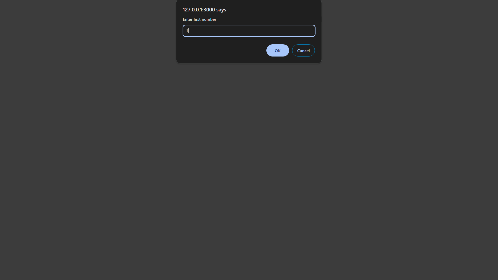
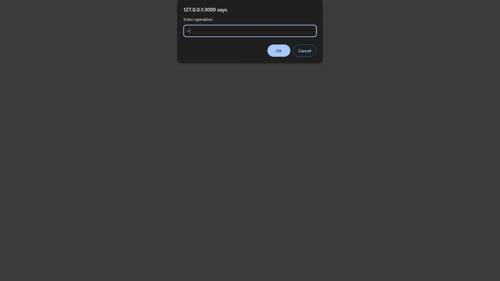
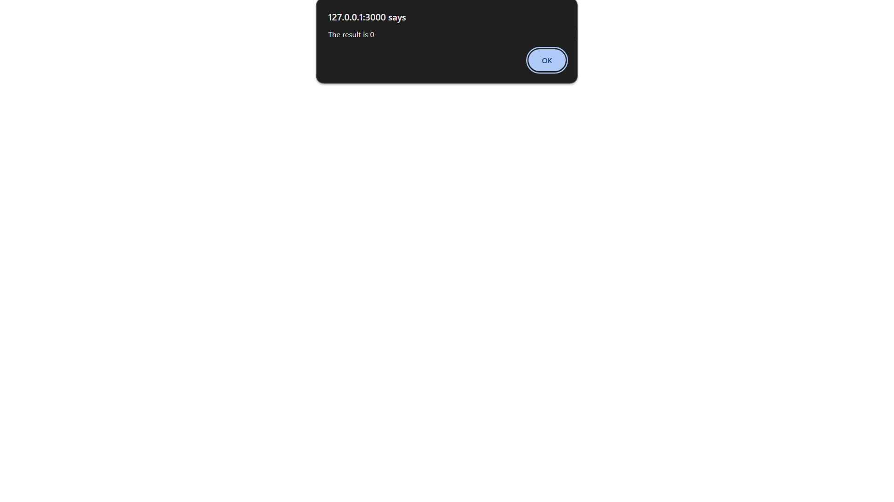

# Faulty Calculator

The **Faulty Calculator** is a simple web application that performs basic arithmetic operations. However, it intentionally introduces random errors to demonstrate the concept of faulty calculations.

## Features
- Addition
- Subtraction
- Multiplication
- Division

## How It Works
1. The calculator prompts the user to enter two numbers and an operation (e.g., +, -, *, /).
2. A random number is generated to determine whether the calculation will be correct or faulty.
3. If the random number is greater than 0.1 (90% chance), the calculator performs the operation correctly and displays the result.
4. If the random number is 0.1 or less (10% chance), the calculator swaps the operation with a faulty one (e.g., + becomes -) and displays the result.

## Usage
1. Open the `index.html` file in your web browser.
2. Enter the first number, choose an operation, and enter the second number.
3. The calculator will display the result, either correct or faulty.

## Screenshots

*Enter first number*

*Enter operation*

*Enter second number*

*The result is*

## Contributing
Contributions are welcome! If you find any bugs or want to improve the calculator, feel free to submit a pull request.

## License
This project is licensed under the MIT License.